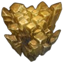

# Dynamis

**Dynamis** is a development/reverse engineering toolbox for Dalamud, including features such as:
- UI for various Dalamud APIs such as the signature scanner and the object table ;
- Object inspector that will try to guess the size and type of what you're trying to look at using just a start address, with support for various types:
  - Objects known to the [FFXIVClientStructs](https://github.com/aers/FFXIVClientStructs) project ;
  - Other game objects ;
  - Functions (using the disassembler shipped with Dalamud) ;
  - Some types have special support (for example, texture objects offer a preview).
- IPFD (In-Process Faux Debugger), a facility that enables setting breakpoints and watchpoints without a debugger:
  - While it cannot meaningfully stop the process for inspection, it instead takes snapshots of threads that hit the breakpoints ;
  - Not stopping the process, though, has the benefit of avoiding disconnection issues due to the game becoming unresponsive from the server's viewpoint ;
  - Snapshots include the CPU state and the entire stack, allowing thorough analysis ;
- Optionally, a hosted PowerShell, that can be used to interact with various facilities from FFXIVClientStructs, Lumina, Dalamud, Dynamis itself, and other plugins ;
  - There are two "distributions" of the plugin: one includes the hosted PowerShell, the other doesn't have it compiled in at all, for people who aren't comfortable in having that running in their game process.

Please note that while Dynamis' tools have some overlap with existing ones, it doesn't try to cover all cases, and therefore is best used in complement of other tools such as IDA/Ghidra/Binja, ReClass, x64dbg/CE, etc., rather than in these tools' stead.

## Installing

1. In `/xlsettings`, add `https://raw.githubusercontent.com/Exter-N/Dynamis/dalamondieu/repo.json` to your custom repositories ;
2. In `/xlplugins`, install one of the distributions of the plugin ;
3. (Optional, but strongly recommended) Check `/dynamis settings` and configure it to your liking. If you're a ClientStructs contributor, you can provide it with your own copy of [data.yml](https://github.com/aers/FFXIVClientStructs/blob/main/ida/data.yml) instead of having it automatically fetch and manage it.

At a later point, if you want to extend Dynamis to better suit your own use cases, and/or contribute to it, you may then grab the source and compile it yourself to use it as a dev plugin. If you don't want to bother with compiling IPFD (which requires a Rust toolchain), you may just get the DLL from the releases/actions, and put it where the .NET project expects it.

## Inter-Plugin API

Dynamis exposes various functions through Dalamud's IPC mechanisms.

[You can find documentation about these functions here.](docs/ipc-api.md)

## Hosted PowerShell Cmdlets

Dynamis provides custom cmdlets in its hosted PowerShell to interact with FFXIVClientStructs, Lumina, Dalamud and others.

[You can find documentation about these cmdlets here.](docs/cmdlets.md)
